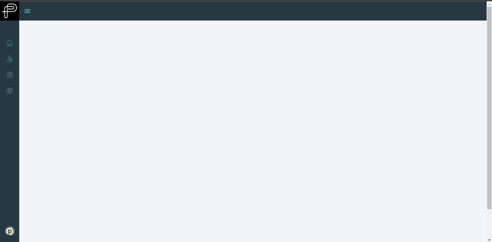
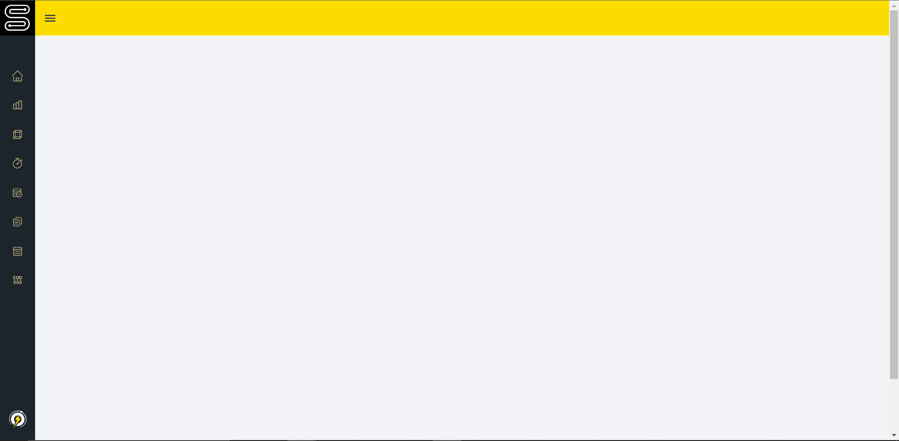

# **Sonicbolt UI**

A React UI component library to develop modules for SIM and PTS.

## **Prequisites**

Packages needed for the library to run

-  react v17 or above
-  react-router v17 or above
-  react-router-dom v6.3.0 or above

## **Installation**

This library can be installed as a normal npm package.

    npm install @kaijin1234/sonicboltui@latest

## **Usage**

The library consists of the following React components.

-  MainLayout
-  Container
-  Button

### **1. MainLayout**

MainLayout will render the Navbar and Sidebar for the app. This is the main wrapper component that should be placed at the beginning of a module. This wrapper loads the PTS layout by default.

**#NOTE**

It requires `react-router-dom` as a dependency with a version of `6.3.0` or above .

```jsx
//import
import { MainLayout } from "@kaijin1234/sonicboltui"


//using the component
//requires BrowserRouter from 'react-router-dom'
return (
    <BrowserRouter>
        <Mainlayout>
            //your code here
        </MainLayout>
    </BrowserRouter>
)
```



```jsx
//import
import { MainLayout } from "@kaijin1234/sonicboltui"


//using the component
//requires BrowserRouter from 'react-router-dom'
return (
    <BrowserRouter>
        <Mainlayout app="SIM">
            //your code here
        </MainLayout>
    </BrowserRouter>
)
```



#### **Props**

| Name | Options      | Default | Behavior                             |
| ---- | ------------ | ------- | ------------------------------------ |
| app  | "SIM", "PTS" | PTS     | Renders either the PTS or SIM layout |

### **MainLayout Context**

MainLayout also provides context which can be accessed by all children components. These can be accessed by importing the `useSidebarCtx`.

```jsx
import { useSidebarCtx } from "@kaijin1234/sonicboltui"

//usage
const { app, isExpanded, toggleSidebar } = useSidebarCtx()
```

| Name          | Type         | Default | Behavior                                                                       |
| ------------- | ------------ | ------- | ------------------------------------------------------------------------------ |
| app           | "SIM", "PTS" | PTS     | Returns if the app is SIM or PTS                                               |
| isExpanded    | boolean      | false   | Returns a boolean value which indicates whether the Sidebar is expanded or not |
| toggleSidebar | function     | -       | This function can be used to manually toggle the Sidebar                       |

### **2. Container**

A customisable container component. This component will not work without `MainLayout`.

```jsx
import { MainLayout, Container } from "@kaijin1234/sonicboltui"

//usage
return (
   <BrowserRouter>
      <Container title="Chart">//your code here</Container>
   </BrowserRouter>
)
```
